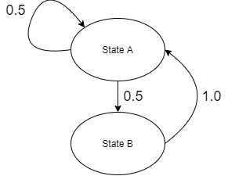

Since I got the keyword Markov chain from my previous post (information theory 2), I started to think about it.

Q. What is Markov chain?

A. This video helped me a lot understanding markov chain.

Origin of Markov chains, Khan Academy: https://youtu.be/Ws63I3F7Moc>

The theory inventors might be: Bernoulli &rarr; Markov &rarr; Shannon

"Markov showed the law of large numbers also works in the system of dependent variables"

Markov's idea is called "chain" because the system can be represented as a directional graph (Markov state diagram).

